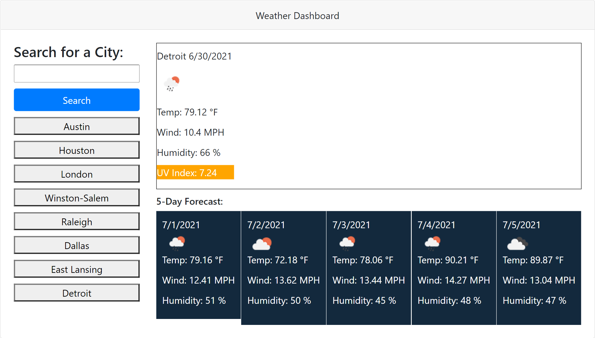

# weather-dashboard-repo

Weather Dashboard Project

## Description

- What was your motivation? 

    My motivation for tackling the project was to learn how to use 3rd party api and fetch request in my Javascript code.

- Why did you build this project? (Note: the answer is not "Because it was a homework assignment.") 

    I built the project to further develop my javascript skills using APIs, fetch and localStorage. 

- What problem does it solve?

    Learning about 3rd party APIs and fetch request helps with requesting data users might want from websites.

- What did you learn?

    I learned different types of APIs and fetch functions.

## ScreenShot

## Link to Deployed Website

https://acromarti01.github.io/weather-dashboard-repo/

